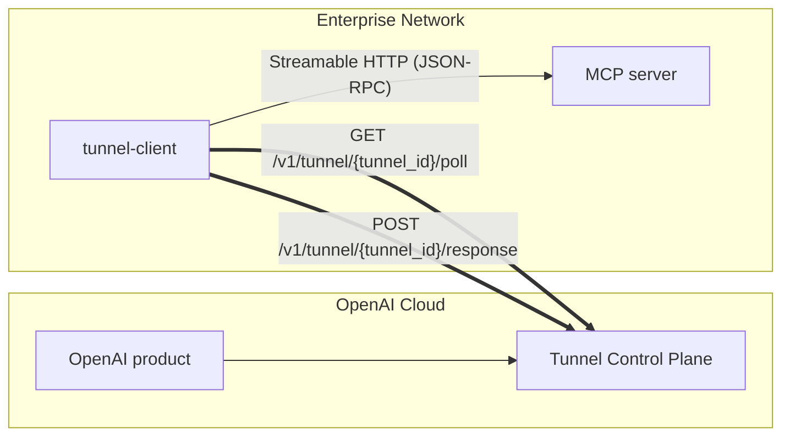

# Architecture

`tunnel-client` is a single-process agent that bridges the tunnel control plane with your internal MCP server.

## High-level data flow

## Runtime components (code map)

- **CLI / process entry**
  - `cmd/client`: loads config, wires Fx, starts the app.
- **Configuration**
  - `pkg/config`: flag/env parsing, validation, defaults.
- **Control plane**
  - `pkg/controlplane`: builds the HTTP client and runs the poll loop.
- **Dispatcher**
  - `pkg/dispatcher`: bounded in-memory queue sized by `control-plane.max-inflight`.
  - `pkg/dispatcher/internal`: worker pool sized by `mcp.max-concurrent-requests`, forwards to MCP, posts responses back.
- **MCP client**
  - `pkg/mcpclient`: Streamable HTTP MCP transport, header forwarding, startup probe.
- **Ops surface**
  - `pkg/health`: `/healthz`, `/readyz`, `/metrics`.
  - `pkg/metrics`: Prometheus exporter + OTel meter provider.
  - `pkg/process`: optional PID file lifecycle.

## Important behaviors / current limitations

- **Outbound-only**: the tunnel itself requires no inbound connectivity. The only inbound port is the optional local admin server.
- **Queueing/backpressure**: the control-plane poller requests up to the number of available slots in the bounded queue to avoid unbounded buffering.
- **Progress/notifications**: MCP JSON-RPC notifications emitted during long-running calls are currently not relayed back to the control plane.
- **Streaming semantics**: the client forwards a final JSON-RPC response per request; it does not currently stream intermediate updates back through the control plane.
